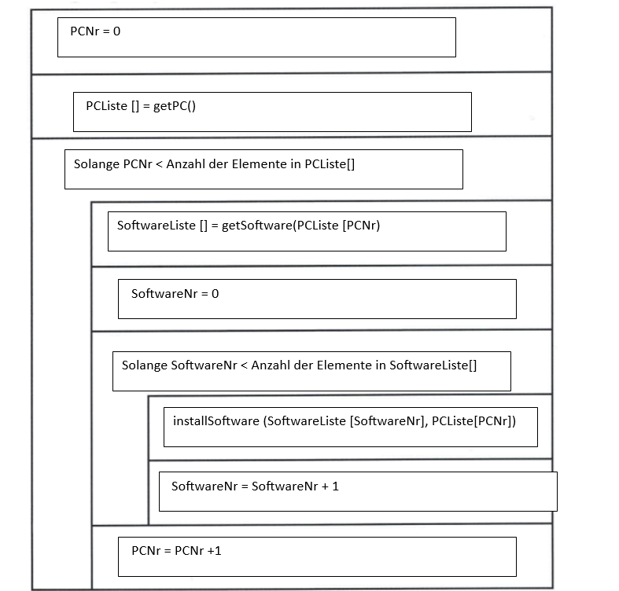

## Aufgabe:
  
  
  
  
  
  

----

## Lösungen: 

# Aufgabe 4 a:

1. Sie bereiten den PC vor damit der User sofort mit dem Programm arbeiten kann
2. Voraussetzung für die automatische Installation sind Aufsetzungspakete die keinen User Input benötigen
3. Diese PAket ewerden von einem Software Verteilungsagent installiert und konfiguriert und müssen auf jedem PC vorhanden sein
4. Es ist nicht nötig, dass das verantwortliche PErsonal für jedes Gerät die Zugangsberechtigung hat

# Aufgabe 4 b

Vorteile:
1. Cloudbasierte Software kann an wechselnde Anforderungen einfach angepasst werden.
2. Es muss keine teure Hardware installiert werden, wass bedeutet das die Anfangskosten in der Regel niedriger sind da die Kosten für Wartung und Upgrades im Service enthalten sind

Nachteile:
1. Ohne eine stabiele Internetverbindung kann der Zugriff auf die cloudbasierte SOftware eingeschränkt oder unmöglich sein 
2. Da die Daten extern gespeichert werden, ist der DAtenschutz und die Sicherheit dieser Daten nicht gewährleistet 

# Aufgabe 4 c
Gegeben: 
Fremdbezug = 25,00 EUR pro Jahr pro Lizenz 
Eigenentwicklung = Personalaufwand von 12.000 Stunden 
Jährliche Wartung = 140 Stunden pro Jahr 
Mitarbeiter stundengehalt = 75 EUR

Fremdbezug 10 Jahre = 25,00 * 10 
                    = 250,00 EUR pro Lizenz 

Kosten Eigenentwicklung (ohne Wartung) = 12.000 * 75
                                       = 900.000 EUR

Wartung 10 Jahre = 140 * 10 
                 = 1400 Stunden 
            
Kosten Wartung = 1400 * 75 EUR
               = 105.000 EUR

Kosten Eigenentwicklung gesamt = 105.000 + 900.000
                               = 1.005.000 EUR

1.005.000 / 250,00 EUR = 4.020 

Antwort = Ab einer Lizenzanzahl von 4.021 ist die Eigenentwicklung günstiger 

# Aufgabe 4 d 
 
 
# Aufgabe 4 e

Gegeben: 
Dateigröße = 100MiByte
Download = 100Mbit/s
Upload = 40 Mbit/s

Datenmenge in MBit 

100MiByte = 100 + 104.857.600 Byte 
104.857.600 * i8 = 838.860.800 bit
838.860.800 / 1.000.000 = 838,86 Mbit

Download-Zeit 

t = Datenmenge (Mbit) / Geschwindigkeit (Mbit/s)

t = 838,86 / 100

t = 8,3886 

t= 9s

t= 0,15 min

## Lösung Test Aufgaben:

#### Test Aufgabe zu 4 c):
Gegeben: 
Fremdbezug = 30,00 EUR pro Jahr pro Lizenz  
Eigenentwicklung = Personalaufwand von 14.000 Stunden  
Jährliche Wartung = 160 Stunden pro Jahr  
Mitarbeiter stundengehalt = 90 EUR 

Fremdbezug 10 Jahre = 30,00 * 10  
                    = 300,00 EUR pro Lizenz  

Kosten Eigenentwicklung (ohne Wartung) = 14.000 * 90 
                                       = 1.260.000 EUR 

Wartung 10 Jahre = 160 * 10  
                 = 1600 Stunden  
            
Kosten Wartung = 1600 * 90 EUR 
               = 144.000 EUR 

Kosten Eigenentwicklung gesamt = 144.000 + 1.260.000 
                               = 1.404.000 EUR 

1.404.000 / 300,00 EUR = 4.680 

Antwort = Ab einer Lizenzanzahl von 4.681 ist die Eigenentwicklung günstiger  
